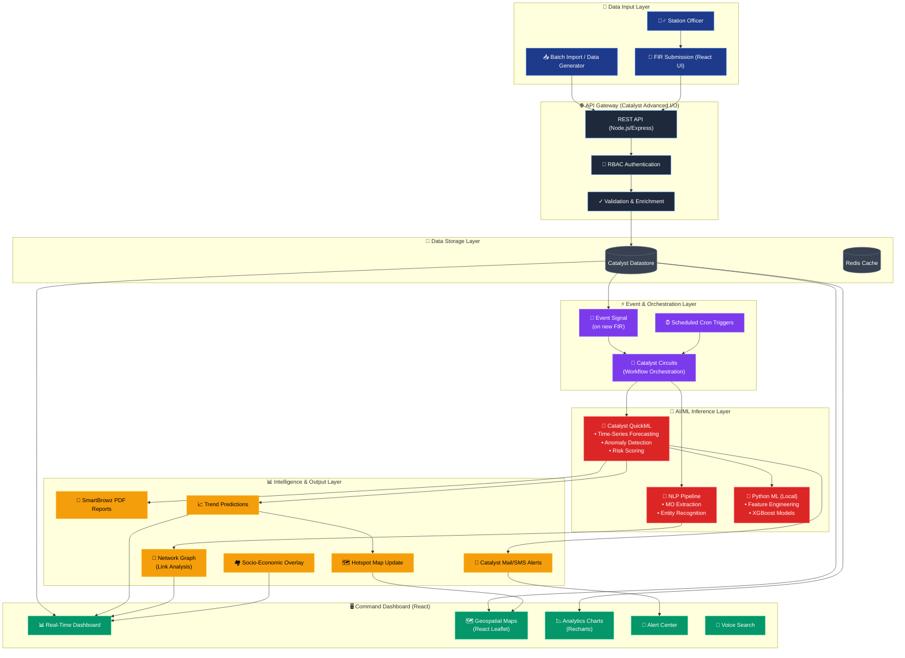

<div align="center">
  
  <h1>🚨 Crime Intelligence Agent</h1>
  <p><strong>AI-Driven Crime Analytics & Visualization Platform for the Karnataka State Police</strong></p>
  
  <p>
    <a href="#-the-challenge">Challenge</a> •
    <a href="#-solution">Solution</a> •
    <a href="#-features">Features</a> •
    <a href="#-tech-stack">Tech Stack</a> •
    <a href="#-getting-started">Getting Started</a> •
    <a href="#-demo-access">Demo Access</a>
  </p>
</div>

---

[](https://opensource.org/licenses/MIT)
[]()
[]()
[]()
[]()

A next-generation platform that transforms how law enforcement processes, analyzes, and acts on crime data. Built for the **Karnataka State Police (KSP)**, it replaces siloed manual records with interactive dashboards, geospatial intelligence, network analysis, and ML-driven predictions — enabling proactive, data-informed policing at State, District, and Station levels.

---

## 📋 The Challenge

The KSP maintains extensive crime records, but the analytical ecosystem is fragmented:

- **Data Silos** — Records trapped in Excel sheets, no cross-jurisdictional visibility
- **Reactive Policing** — Manual intelligence reporting takes days, delaying intervention
- **Hidden Patterns** — No AI to surface behavioral links, organized crime networks, or emerging trends
- **Information Gaps** — SCRB receives limited, fragmented data for state-wide analysis

Details: [`PROBLEM_STATEMENT.md`](./PROBLEM_STATEMENT.md)

## 💡 Solution

**Crime Intelligence Agent** shifts from reactive record-keeping to a **Strategic Intelligence Hub**:

- Interactive dashboards and geospatial maps for real-time situational awareness
- Criminological network & link analysis to reveal hidden criminal associations
- Sociological correlation overlays (urbanization, population, socio-economic indicators)
- ML-driven predictive risk scoring, anomaly detection, and trend forecasting
- Role-based access control for SCRB Admins, District Officers, and Station Officers

---

## ✨ Features

### 📊 Advanced Visualization
- **District-Level Drill-down** — Interactive maps for SCRB to visualize crime patterns across districts and police stations
- **Spatiotemporal Clusters** — Identify hotspots by layering time-of-day with location
- **Emerging Trend Alerts** — Visual indicators when a crime category spikes vs historical averages

### 🔗 Network & Link Analysis
- **Relationship Mapping** — Node-based visualization connecting suspects, victims, and locations
- **Repeat Offender Tracking** — Visual profiles linking individuals to multiple incidents with MO
- **Association Detection** — Uncover hidden criminal networks invisible in isolated records

### 🧠 AI/ML-Driven Intelligence
- **Predictive Risk Scoring** — Forecast high-risk areas and emerging crime typologies
- **Anomaly Detection** — Flag incidents deviating from behavioral patterns
- **Time-Series Forecasting** — Predict crime volumes by district using QuickML
- **Socio-Economic Correlation** — Understand the "why" behind the "where"

### 🚨 Automated Operations
- **Real-Time FIR Processing** — Instant ingestion and structuring of textual FIR data
- **Automated Intelligence Reports** — Dynamic PDF generation from ML insights
- **Proactive Alerts** — Email/SMS notifications sent when anomalies are detected
- **Resource Deployment** — Data-driven patrol dispatch recommendations

---

## 🛠️ Tech Stack

### Cloud Infrastructure (Zoho Catalyst)
- **Catalyst Datastore** — Relational database for FIRs, Districts, Stations, ML Predictions
- **Catalyst Advanced I/O** — Node.js/Express REST API backend
- **Catalyst Event Signals** — Asynchronous triggers on new FIR insertions
- **Catalyst Circuits** — Workflow orchestration for AI inference pipeline
- **Catalyst QuickML** — ML model training and deployment for forecasting
- **Catalyst SmartBrowz** — Dynamic PDF intelligence report generation

### Application Layer
- **Frontend**: React 18, TailwindCSS, React Leaflet (maps), Recharts (visualization), Framer Motion
- **Backend API**: Node.js, Express.js
- **Data Science / ML**: Python 3.13, Scikit-Learn, Pandas, XGBoost, Imbalanced-learn

### Design System
A comprehensive [design system](./DESIGN_SYSTEM.md) with WCAG 2.1 AAA compliance — navy/gold palette optimized for command-center dark-mode environments, semantic alert colors, and police-specific typography.

---

## 🏗️ Architecture & Data Flow

The system follows a serverless microservices architecture. Below is the end-to-end flow from FIR submission to intelligence output:



### Flow Summary

| Step | Layer | Action |
|:---|:---|---|
| **1** | 📝 Input | Officer submits FIR via dashboard or batch import |
| **2** | 🌐 API Gateway | REST API authenticates, validates, and persists to Datastore |
| **3** | ⚡ Events | Event Signal fires → Circuits orchestrates the intelligence pipeline |
| **4** | 🧠 AI/ML | QuickML runs forecasts, anomaly detection, risk scoring; NLP extracts entities |
| **5** | 📊 Output | PDFs generated, alerts dispatched, dashboard updated in real-time |

Additional documentation:
- [Database Design](./docs/database_design_document.md)
- [ML Integration](./docs/ML_INTEGRATION.md)
- [Design Patterns](./docs/patterns.md)
- [Graph Knowledge Base](./graphify-out/GRAPH_REPORT.md)

---

## 💻 Getting Started

### Prerequisites
- [Node.js](https://nodejs.org/) (v18+)
- [Python](https://www.python.org/) (3.13+)
- [Zoho Catalyst CLI](https://catalyst.zoho.com/help/cli.html) (`npm install -g zcatalyst-cli`)
- A Zoho Catalyst account

### Quick Start

**1. Clone the Repository**
```bash
git clone https://github.com/Team-Infinite-Parallax/Crime-Intelligence-Agent.git
cd Crime-Intelligence-Agent
```

**2. Setup Backend (Catalyst Functions)**
```bash
cd functions/api_service
npm install
```

**3. Setup Frontend (React Client)**
```bash
cd ../../client
npm install
npm run dev
```

**4. Setup Python ML Environment (optional)**
```bash
cd ..
python -m venv .venv
# Windows: .venv\Scripts\activate
# Mac/Linux: source .venv/bin/activate
pip install -r requirements.txt
```

### Zoho Catalyst Deployment
```bash
catalyst login
catalyst init
catalyst deploy
```

---

## 🔑 Demo Access

| Role | Officer Name | Login ID | Passcode | Access Level |
| :--- | :--- | :--- | :--- | :--- |
| 🛡️ **SCRB Admin (HQ)** | Prashant Kumar | `KSP-SCRB-100` | `100` | State-wide analytics, ML config, System overview |
| 📍 **District Officer** | Praveen Verma | `KSP-DIST-009` | `009` | District-level hotspots, Anomaly alerts, Resource planning |
| 🚓 **Station Officer** | Mohammed Puttaiah | `KSP-UNIT-001` | `001` | Station-level FIR logging, Local case management |

---

## 🗺️ Project Structure

```
├── client/                  # React frontend
│   ├── src/
│   │   ├── components/      # Dashboard widgets, Layouts
│   │   ├── contexts/        # Filter state management
│   │   ├── data/            # Static data & network graph data
│   │   └── utils/           # Helpers & CoP bot integration
├── functions/               # Zoho Catalyst serverless functions
│   ├── api_service/         # REST API (Node.js/Express)
│   ├── predictions/         # ML prediction handler
│   └── ml-batch-update/     # Batch ML update function
├── ml/                      # Python ML scripts
│   ├── models.py            # Model definitions
│   ├── feature_engineering.py
│   ├── quickml_integration.py
│   └── tests/               # ML test suite
├── docs/                    # Documentation
├── scripts/                 # Utility scripts
├── tests/                   # Integration/E2E tests
├── data-generator/          # Synthetic data generation
├── DESIGN_SYSTEM.md         # Design system & visual spec
├── PROBLEM_STATEMENT.md     # Problem & scope definition
└── graphify-out/            # Knowledge graph (architecture)
```

---

## 🚀 Roadmap

- **CCTV Integration** — Real-time facial recognition and vehicle plate tracking
- **NLP on FIR Narratives** — Automated MO extraction and suspect description parsing using LLMs
- **Social Media Sentiment** — Public sentiment monitoring as a leading indicator for unrest
- **Graph Knowledge Base** — Persistent queryable knowledge graph of the codebase via [graphify](https://github.com/anomalyco/graphify)

---

## Quality Mandate

This project targets **100/100** across Code Quality, Security, Efficiency, Testing, Accessibility, and Problem Statement Alignment. See [`PROBLEM_STATEMENT.md`](./PROBLEM_STATEMENT.md#quality-mandate) for details.

---

<div align="center">
  <b>Built for the Karnataka State Police</b><br>
  <i>Empowering Law Enforcement with Data-Driven Intelligence</i>
</div>
