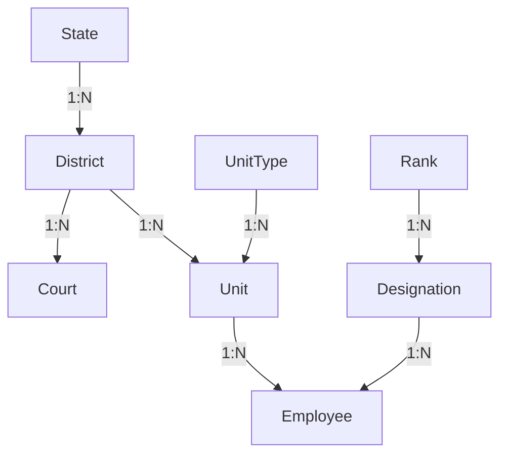
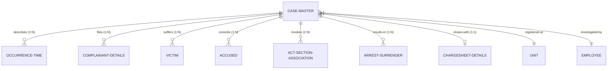
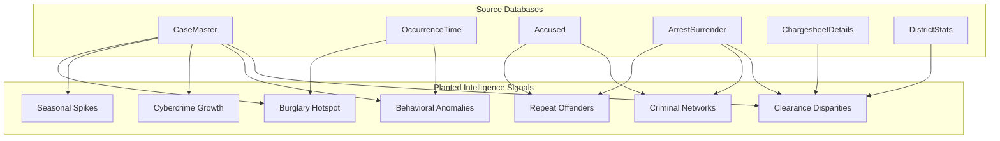

# Karnataka Police FIR Database Design & Architecture Document
## AI Crime Intelligence Platform (Zoho Catalyst Implementation)

This document provides a comprehensive technical architecture, design, and reference guide for the Karnataka Police Department's FIR database. It outlines the schema, entity relationships, business justifications, analytics dashboard applications, machine learning integration vectors, indexing strategies, derived tables, and API specifications.

---

## 1. Table-by-Table Deep Dive

This section details the 28 tables in the FIR database. Each entry explains the table's purpose, usage in dashboards and AI models, relationships, and API connections.

### 1. State
* **Description**: A master lookup table containing the names of states.
* **Why it exists**: To support multi-state lookup capabilities and provide the highest-level geographical boundary for administrative and legal jurisdictions.
* **Dashboard Usage**: High-level geographic filters; comparative crime rates between Karnataka and neighboring states.
* **AI/ML Usage**: Geographic categorical feature for multi-state crime movement models.
* **Relationships**:
  * One-to-Many with [District](file:///c:/Users/himan/Desktop/ksp-datathon/data-generator/table-definitions.md#L26) (`State.StateID` $\rightarrow$ `District.StateID`).
* **Key APIs**: `GET /api/v1/states`, `POST /api/v1/states` (admin only).

### 2. District
* **Description**: Contains administrative districts within a state.
* **Why it exists**: Police administration in Karnataka is structured around districts (e.g., Bengaluru Urban, Mysuru, Belagavi). This table isolates operations and crime tracking at the district commissionerate or superintendent level.
* **Dashboard Usage**:
  * Heatmaps showing crime density by district.
  * District ranking leaderboards based on case registration volume and clearance rates.
* **AI/ML Usage**: Target variable segmenting for spatial models; district-level socio-economic clustering.
* **Relationships**:
  * Many-to-One with [State](file:///c:/Users/himan/Desktop/ksp-datathon/data-generator/table-definitions.md#L8) (`District.StateID` $\rightarrow$ `State.StateID`).
  * One-to-Many with [Unit](file:///c:/Users/himan/Desktop/ksp-datathon/data-generator/table-definitions.md#L49) (`District.DistrictID` $\rightarrow$ `Unit.DistrictID`).
  * One-to-Many with [Court](file:///c:/Users/himan/Desktop/ksp-datathon/data-generator/table-definitions.md#L197) (`District.DistrictID` $\rightarrow$ `Court.DistrictID`).
  * One-to-Many with [CaseMaster](file:///c:/Users/himan/Desktop/ksp-datathon/data-generator/table-definitions.md#L207) (`District.DistrictID` $\rightarrow$ `CaseMaster.DistrictID`).
* **Key APIs**: `GET /api/v1/districts`, `GET /api/v1/districts/:id/stats`.

### 3. UnitType
* **Description**: Classifies the category of police units (e.g., Police Station, Circle Office, DSP Office, Commissionerate).
* **Why it exists**: To maintain organizational hierarchy and differentiate operational stations (which register FIRs) from supervisory offices.
* **Dashboard Usage**: Filtering crime data to show only active local police stations vs. specialized units (e.g., Cyber Crime PS).
* **AI/ML Usage**: Normalizing crime volumes based on unit operational capabilities.
* **Relationships**:
  * One-to-Many with [Unit](file:///c:/Users/himan/Desktop/ksp-datathon/data-generator/table-definitions.md#L49) (`UnitType.UnitTypeID` $\rightarrow$ `Unit.UnitTypeID`).
* **Key APIs**: `GET /api/v1/unit-types`.

### 4. Unit
* **Description**: Represents individual police units, primarily police stations, with their GPS coordinates.
* **Why it exists**: The primary operational node where crime is reported, investigated, and managed.
* **Dashboard Usage**:
  * Pinpointing crime coordinates to specific police stations.
  * Workload analysis: active cases per station.
* **AI/ML Usage**: Geo-spatial clustering (e.g., K-Means) to identify hotspots; predicting police station response times.
* **Relationships**:
  * Many-to-One with [District](file:///c:/Users/himan/Desktop/ksp-datathon/data-generator/table-definitions.md#L26) (`Unit.DistrictID` $\rightarrow$ `District.DistrictID`).
  * Many-to-One with [UnitType](file:///c:/Users/himan/Desktop/ksp-datathon/data-generator/table-definitions.md#L40) (`Unit.UnitTypeID` $\rightarrow$ `UnitType.UnitTypeID`).
  * One-to-Many with [Employee](file:///c:/Users/himan/Desktop/ksp-datathon/data-generator/table-definitions.md#L82) (`Unit.UnitID` $\rightarrow$ `Employee.UnitID`).
  * One-to-Many with [CaseMaster](file:///c:/Users/himan/Desktop/ksp-datathon/data-generator/table-definitions.md#L207) (`Unit.UnitID` $\rightarrow$ `CaseMaster.UnitID`).
* **Key APIs**: `GET /api/v1/units`, `GET /api/v1/units/:id/workload`.

### 5. Rank
* **Description**: Standardized police ranks (e.g., Constable, Head Constable, Sub-Inspector, Inspector, DSP).
* **Why it exists**: To maintain the command structure and enforce role-based access control (RBAC) across the platform.
* **Dashboard Usage**: HR dashboards displaying personnel distribution and vacancy rates by rank.
* **AI/ML Usage**: Investigating officer (IO) assignment optimization models (matching case gravity to SI/PI ranks).
* **Relationships**:
  * One-to-Many with [Designation](file:///c:/Users/himan/Desktop/ksp-datathon/data-generator/table-definitions.md#L72) (`Rank.RankID` $\rightarrow$ `Designation.RankID`).
* **Key APIs**: `GET /api/v1/ranks`.

### 6. Designation
* **Description**: Functional roles assigned to officers (e.g., Station House Officer (SHO), Investigating Officer (IO), Writer).
* **Why it exists**: Ranks represent hierarchy, whereas designations represent specific functional responsibilities. This ensures appropriate business logic execution.
* **Dashboard Usage**: Resource allocation audits (e.g., verifying that every station has an active SHO).
* **AI/ML Usage**: Feature in police performance and clearance prediction models.
* **Relationships**:
  * Many-to-One with [Rank](file:///c:/Users/himan/Desktop/ksp-datathon/data-generator/table-definitions.md#L62) (`Designation.RankID` $\rightarrow$ `Rank.RankID`).
  * One-to-Many with [Employee](file:///c:/Users/himan/Desktop/ksp-datathon/data-generator/table-definitions.md#L82) (`Designation.DesignationID` $\rightarrow$ `Employee.DesignationID`).
* **Key APIs**: `GET /api/v1/designations`.

### 7. Employee
* **Description**: Detailed roster of Karnataka Police personnel.
* **Why it exists**: Identifies the personnel registering cases, conducting arrests, and writing chargesheets, establishing a clear audit trail.
* **Dashboard Usage**:
  * Officer performance metrics (average days to resolve cases, chargesheet rate).
  * Staffing directories.
* **AI/ML Usage**: Predictive profiling for workload balancing; modeling case outcome likelihood based on IO experience and history.
* **Relationships**:
  * Many-to-One with [Unit](file:///c:/Users/himan/Desktop/ksp-datathon/data-generator/table-definitions.md#L49) (`Employee.UnitID` $\rightarrow$ `Unit.UnitID`).
  * Many-to-One with [Designation](file:///c:/Users/himan/Desktop/ksp-datathon/data-generator/table-definitions.md#L72) (`Employee.DesignationID` $\rightarrow$ `Designation.DesignationID`).
  * One-to-Many with [CaseMaster](file:///c:/Users/himan/Desktop/ksp-datathon/data-generator/table-definitions.md#L207) (`Employee.EmployeeID` $\rightarrow$ `CaseMaster.IOEmployeeID`).
  * One-to-Many with [ArrestSurrender](file:///c:/Users/himan/Desktop/ksp-datathon/data-generator/table-definitions.md#L307) (`Employee.EmployeeID` $\rightarrow$ `ArrestSurrender.ArrestingOfficerID`).
* **Key APIs**: `GET /api/v1/employees`, `GET /api/v1/employees/:id/performance`.

### 8. Act
* **Description**: Legal frameworks (e.g., Indian Penal Code (IPC), NDPS Act, Information Technology Act).
* **Why it exists**: Forms the legal foundation of criminal prosecution. Every offense must map to a specific legislative act.
* **Dashboard Usage**: Trend analysis of crimes registered under major acts (e.g., IT Act vs. IPC).
* **AI/ML Usage**: Text classification target categories; identifying legislative trends.
* **Relationships**:
  * One-to-Many with [Section](file:///c:/Users/himan/Desktop/ksp-datathon/data-generator/table-definitions.md#L108) (`Act.ActID` $\rightarrow$ `Section.ActID`).
* **Key APIs**: `GET /api/v1/acts`.

### 9. Section
* **Description**: Specific statutory sections under each Act (e.g., Section 302 for Murder, Section 379 for Theft).
* **Why it exists**: Captures the precise legal nature of the crime for prosecution and court trials.
* **Dashboard Usage**: Granular crime breakdown charts; identifying most frequently violated sections.
* **AI/ML Usage**: Multi-label classification models predicting sections from raw case facts (`BriefFacts`).
* **Relationships**:
  * Many-to-One with [Act](file:///c:/Users/himan/Desktop/ksp-datathon/data-generator/table-definitions.md#L98) (`Section.ActID` $\rightarrow$ `Act.ActID`).
  * One-to-Many with [CrimeHeadActSection](file:///c:/Users/himan/Desktop/ksp-datathon/data-generator/table-definitions.md#L139) (`Section.SectionID` $\rightarrow$ `CrimeHeadActSection.SectionID`).
  * One-to-Many with [ActSectionAssociation](file:///c:/Users/himan/Desktop/ksp-datathon/data-generator/table-definitions.md#L297) (`Section.SectionID` $\rightarrow$ `ActSectionAssociation.SectionID`).
* **Key APIs**: `GET /api/v1/sections`, `GET /api/v1/sections/search`.

### 10. GravityOffence
* **Description**: Classification of crime severity (e.g., Heinous, Non-Heinous).
* **Why it exists**: Drives administrative escalations, prioritizes investigations, and determines whether senior officers (e.g., DSP/SP) must supervise.
* **Dashboard Usage**:
  * Heinous Crime Clock.
  * Executive KPIs showing the volume of Heinous vs. Non-Heinous crimes.
* **AI/ML Usage**: Priority scoring models for dispatching resource assistance; anomaly detection (identifying heinous crimes in historically low-crime areas).
* **Relationships**:
  * One-to-Many with [CrimeHead](file:///c:/Users/himan/Desktop/ksp-datathon/data-generator/table-definitions.md#L119) (`GravityOffence.GravityOffenceID` $\rightarrow$ `CrimeHead.GravityOffenceID`).
  * One-to-Many with [CaseMaster](file:///c:/Users/himan/Desktop/ksp-datathon/data-generator/table-definitions.md#L207) (`GravityOffence.GravityOffenceID` $\rightarrow$ `CaseMaster.GravityOffenceID`).
* **Key APIs**: `GET /api/v1/gravity-offences`.

### 11. CrimeHead
* **Description**: Major classification groups of crimes (e.g., Crimes Against Body, Property Offences, Cyber Crimes).
* **Why it exists**: Enables standardization of crime groupings for state-level and national reporting (NCRB guidelines).
* **Dashboard Usage**: High-level pie charts of crime distribution.
* **AI/ML Usage**: Top-level class prediction in hierarchical classification models.
* **Relationships**:
  * Many-to-One with [GravityOffence](file:///c:/Users/himan/Desktop/ksp-datathon/data-generator/table-definitions.md#L17) (`CrimeHead.GravityOffenceID` $\rightarrow$ `GravityOffence.GravityOffenceID`).
  * One-to-Many with [CrimeSubHead](file:///c:/Users/himan/Desktop/ksp-datathon/data-generator/table-definitions.md#L129) (`CrimeHead.CrimeHeadID` $\rightarrow$ `CrimeSubHead.CrimeHeadID`).
  * One-to-Many with [CaseMaster](file:///c:/Users/himan/Desktop/ksp-datathon/data-generator/table-definitions.md#L207) (`CrimeHead.CrimeHeadID` $\rightarrow$ `CaseMaster.CrimeHeadID`).
* **Key APIs**: `GET /api/v1/crime-heads`.

### 12. CrimeSubHead
* **Description**: Granular sub-classifications of crimes (e.g., Murder for Gain under Crimes Against Body, Chain Snatching under Property Offences).
* **Why it exists**: Pinpoints the exact operational category of crime, crucial for specialized police wings (e.g., Anti-Dacoity squad).
* **Dashboard Usage**:
  * Crime-specific trend lines (e.g., seasonal burglary spikes).
  * Incident heatmaps filtered by sub-head.
* **AI/ML Usage**: Fine-grained text classification; temporal forecasting models for specific crime types.
* **Relationships**:
  * Many-to-One with [CrimeHead](file:///c:/Users/himan/Desktop/ksp-datathon/data-generator/table-definitions.md#L119) (`CrimeSubHead.CrimeHeadID` $\rightarrow$ `CrimeHead.CrimeHeadID`).
  * One-to-Many with [CrimeHeadActSection](file:///c:/Users/himan/Desktop/ksp-datathon/data-generator/table-definitions.md#L139) (`CrimeSubHead.CrimeSubHeadID` $\rightarrow$ `CrimeHeadActSection.CrimeSubHeadID`).
  * One-to-Many with [CaseMaster](file:///c:/Users/himan/Desktop/ksp-datathon/data-generator/table-definitions.md#L207) (`CrimeSubHead.CrimeSubHeadID` $\rightarrow$ `CaseMaster.CrimeSubHeadID`).
* **Key APIs**: `GET /api/v1/crime-sub-heads`.

### 13. CrimeHeadActSection
* **Description**: Mapping table linking crime sub-heads to standard legal sections.
* **Why it exists**: Restricts data-entry errors by recommending standard penal sections when an officer selects a specific crime category.
* **Dashboard Usage**: Compliance tracking (validating if the correct sections were applied for a registered crime type).
* **AI/ML Usage**: Creating graph embeddings of crime types and their associated legal codes.
* **Relationships**:
  * Many-to-One with [CrimeSubHead](file:///c:/Users/himan/Desktop/ksp-datathon/data-generator/table-definitions.md#L129) (`CrimeHeadActSection.CrimeSubHeadID` $\rightarrow$ `CrimeSubHead.CrimeSubHeadID`).
  * Many-to-One with [Section](file:///c:/Users/himan/Desktop/ksp-datathon/data-generator/table-definitions.md#L108) (`CrimeHeadActSection.SectionID` $\rightarrow$ `Section.SectionID`).
* **Key APIs**: `GET /api/v1/crime-head-mappings`.

### 14. CaseCategory
* **Description**: Types of case files (e.g., FIR, UDR (Unnatural Death Report), PAR (Proclaimed Offender Report), Zero FIR).
* **Why it exists**: Determines the procedural track of the file. A Zero FIR must be transferred, a UDR may be upgraded to an FIR, and an FIR follows standard trial rules.
* **Dashboard Usage**: Operational throughput charts by case category.
* **AI/ML Usage**: Feature input for predicting case resolution paths.
* **Relationships**:
  * One-to-Many with [CaseMaster](file:///c:/Users/himan/Desktop/ksp-datathon/data-generator/table-definitions.md#L207) (`CaseCategory.CaseCategoryID` $\rightarrow$ `CaseMaster.CaseCategoryID`).
* **Key APIs**: `GET /api/v1/case-categories`.

### 15. CaseStatusMaster
* **Description**: Roster of possible case statuses (e.g., Under Investigation, Chargesheeted, Abated, Closed).
* **Why it exists**: Serves as the tracking variable for a case's lifecycle.
* **Dashboard Usage**:
  * Disposal rate metrics (e.g., % of cases chargesheeted).
  * Aging analysis (cases pending investigation > 90 days).
* **AI/ML Usage**: Target variable for predicting case closure bottlenecks.
* **Relationships**:
  * One-to-Many with [CaseMaster](file:///c:/Users/himan/Desktop/ksp-datathon/data-generator/table-definitions.md#L207) (`CaseStatusMaster.CaseStatusID` $\rightarrow$ `CaseMaster.CaseStatusID`).
* **Key APIs**: `GET /api/v1/case-statuses`.

### 16. OccupationMaster
* **Description**: Master list of occupations.
* **Why it exists**: Captures demographics to analyze if certain professional groups are targeted or involved in specific crimes.
* **Dashboard Usage**: Demographics widgets (e.g., victimization rates among students, farmers, or IT professionals).
* **AI/ML Usage**: Predictive feature for fraud targeting models.
* **Relationships**:
  * One-to-Many with [ComplainantDetails](file:///c:/Users/himan/Desktop/ksp-datathon/data-generator/table-definitions.md#L245) (`OccupationMaster.OccupationID` $\rightarrow$ `ComplainantDetails.OccupationID`).
  * One-to-Many with [Victim](file:///c:/Users/himan/Desktop/ksp-datathon/data-generator/table-definitions.md#L262) (`OccupationMaster.OccupationID` $\rightarrow$ `Victim.OccupationID`).
  * One-to-Many with [Accused](file:///c:/Users/himan/Desktop/ksp-datathon/data-generator/table-definitions.md#L278) (`OccupationMaster.OccupationID` $\rightarrow$ `Accused.OccupationID`).
* **Key APIs**: `GET /api/v1/occupations`.

### 17. ReligionMaster
* **Description**: Standardized list of religions.
* **Why it exists**: Used for demographic analysis and identifying hate-crimes or communal patterns.
* **Dashboard Usage**: Socio-demographic breakdown charts.
* **AI/ML Usage**: Demographic bias audit metrics.
* **Relationships**:
  * One-to-Many with [CasteMaster](file:///c:/Users/himan/Desktop/ksp-datathon/data-generator/table-definitions.md#L187) (`ReligionMaster.ReligionID` $\rightarrow$ `CasteMaster.ReligionID`).
  * One-to-Many with [ComplainantDetails](file:///c:/Users/himan/Desktop/ksp-datathon/data-generator/table-definitions.md#L245) (`ReligionMaster.ReligionID` $\rightarrow$ `ComplainantDetails.ReligionID`).
  * One-to-Many with [Victim](file:///c:/Users/himan/Desktop/ksp-datathon/data-generator/table-definitions.md#L262) (`ReligionMaster.ReligionID` $\rightarrow$ `Victim.ReligionID`).
  * One-to-Many with [Accused](file:///c:/Users/himan/Desktop/ksp-datathon/data-generator/table-definitions.md#L278) (`ReligionMaster.ReligionID` $\rightarrow$ `Accused.ReligionID`).
* **Key APIs**: `GET /api/v1/religions`.

### 18. CasteMaster
* **Description**: Master list of castes, sub-castes, and categories.
* **Why it exists**: Helps track compliance with special laws, such as the SC/ST (Prevention of Atrocities) Act.
* **Dashboard Usage**: Monitoring atrocities cases and ensuring legal assistance is triggered.
* **AI/ML Usage**: Bias detection; predicting sensitive case triggers.
* **Relationships**:
  * Many-to-One with [ReligionMaster](file:///c:/Users/himan/Desktop/ksp-datathon/data-generator/table-definitions.md#L178) (`CasteMaster.ReligionID` $\rightarrow$ `ReligionMaster.ReligionID`).
  * One-to-Many with [ComplainantDetails](file:///c:/Users/himan/Desktop/ksp-datathon/data-generator/table-definitions.md#L245) (`CasteMaster.CasteID` $\rightarrow$ `ComplainantDetails.CasteID`).
  * One-to-Many with [Victim](file:///c:/Users/himan/Desktop/ksp-datathon/data-generator/table-definitions.md#L262) (`CasteMaster.CasteID` $\rightarrow$ `Victim.CasteID`).
  * One-to-Many with [Accused](file:///c:/Users/himan/Desktop/ksp-datathon/data-generator/table-definitions.md#L278) (`CasteMaster.CasteID` $\rightarrow$ `Accused.CasteID`).
* **Key APIs**: `GET /api/v1/castes`.

### 19. Court
* **Description**: Details of judicial courts trial-jurisdictions.
* **Why it exists**: Tracks where chargesheets are submitted and where prosecutions are actively argued.
* **Dashboard Usage**: Court-wise pending caseload list; conviction rate stats by court.
* **AI/ML Usage**: Modeling conviction probability and court trial duration.
* **Relationships**:
  * Many-to-One with [District](file:///c:/Users/himan/Desktop/ksp-datathon/data-generator/table-definitions.md#L26) (`Court.DistrictID` $\rightarrow$ `District.DistrictID`).
  * One-to-Many with [CaseMaster](file:///c:/Users/himan/Desktop/ksp-datathon/data-generator/table-definitions.md#L207) (`Court.CourtID` $\rightarrow$ `CaseMaster.CourtID`).
  * One-to-Many with [ChargesheetDetails](file:///c:/Users/himan/Desktop/ksp-datathon/data-generator/table-definitions.md#L320) (`Court.CourtID` $\rightarrow$ `ChargesheetDetails.CourtID`).
* **Key APIs**: `GET /api/v1/courts`.

### 20. CaseMaster
* **Description**: The core transactional registry for every criminal case (FIR, UDR, etc.).
* **Why it exists**: Serves as the central transaction record, linking the who (accused, victims, complainants), what (acts, sections, crime types), where (units, districts), and when (registration dates).
* **Dashboard Usage**:
  * Total cases registered KPI (daily, monthly, yearly).
  * Interactive maps.
  * System-wide status tracker.
* **AI/ML Usage**: The primary hub table for all classification, forecasting, anomaly detection, and link analysis models.
* **Relationships**:
  * Many-to-One with [Unit](file:///c:/Users/himan/Desktop/ksp-datathon/data-generator/table-definitions.md#L49) (`CaseMaster.UnitID` $\rightarrow$ `Unit.UnitID`).
  * Many-to-One with [District](file:///c:/Users/himan/Desktop/ksp-datathon/data-generator/table-definitions.md#L26) (`CaseMaster.DistrictID` $\rightarrow$ `District.DistrictID`).
  * Many-to-One with [CaseCategory](file:///c:/Users/himan/Desktop/ksp-datathon/data-generator/table-definitions.md#L149) (`CaseMaster.CaseCategoryID` $\rightarrow$ `CaseCategory.CaseCategoryID`).
  * Many-to-One with [CrimeHead](file:///c:/Users/himan/Desktop/ksp-datathon/data-generator/table-definitions.md#L119) (`CaseMaster.CrimeHeadID` $\rightarrow$ `CrimeHead.CrimeHeadID`).
  * Many-to-One with [CrimeSubHead](file:///c:/Users/himan/Desktop/ksp-datathon/data-generator/table-definitions.md#L129) (`CaseMaster.CrimeSubHeadID` $\rightarrow$ `CrimeSubHead.CrimeSubHeadID`).
  * Many-to-One with [GravityOffence](file:///c:/Users/himan/Desktop/ksp-datathon/data-generator/table-definitions.md#L17) (`CaseMaster.GravityOffenceID` $\rightarrow$ `GravityOffence.GravityOffenceID`).
  * Many-to-One with [CaseStatusMaster](file:///c:/Users/himan/Desktop/ksp-datathon/data-generator/table-definitions.md#L160) (`CaseMaster.CaseStatusID` $\rightarrow$ `CaseStatusMaster.CaseStatusID`).
  * Many-to-One with [Employee](file:///c:/Users/himan/Desktop/ksp-datathon/data-generator/table-definitions.md#L82) (`CaseMaster.IOEmployeeID` $\rightarrow$ `Employee.EmployeeID`).
  * Many-to-One with [Court](file:///c:/Users/himan/Desktop/ksp-datathon/data-generator/table-definitions.md#L197) (`CaseMaster.CourtID` $\rightarrow$ `Court.CourtID`).
  * One-to-Many with [OccurrenceTime](file:///c:/Users/himan/Desktop/ksp-datathon/data-generator/table-definitions.md#L229) (`CaseMaster.CaseID` $\rightarrow$ `OccurrenceTime.CaseID`).
  * One-to-Many with [ComplainantDetails](file:///c:/Users/himan/Desktop/ksp-datathon/data-generator/table-definitions.md#L245) (`CaseMaster.CaseID` $\rightarrow$ `ComplainantDetails.CaseID`).
  * One-to-Many with [Victim](file:///c:/Users/himan/Desktop/ksp-datathon/data-generator/table-definitions.md#L262) (`CaseMaster.CaseID` $\rightarrow$ `Victim.CaseID`).
  * One-to-Many with [Accused](file:///c:/Users/himan/Desktop/ksp-datathon/data-generator/table-definitions.md#L278) (`CaseMaster.CaseID` $\rightarrow$ `Accused.CaseID`).
  * One-to-Many with [ActSectionAssociation](file:///c:/Users/himan/Desktop/ksp-datathon/data-generator/table-definitions.md#L297) (`CaseMaster.CaseID` $\rightarrow$ `ActSectionAssociation.CaseID`).
  * One-to-Many with [ArrestSurrender](file:///c:/Users/himan/Desktop/ksp-datathon/data-generator/table-definitions.md#L307) (`CaseMaster.CaseID` $\rightarrow$ `ArrestSurrender.CaseID`).
  * One-to-One/Many with [ChargesheetDetails](file:///c:/Users/himan/Desktop/ksp-datathon/data-generator/table-definitions.md#L320) (`CaseMaster.CaseID` $\rightarrow$ `ChargesheetDetails.CaseID`).
* **Key APIs**: `GET /api/v1/cases`, `GET /api/v1/cases/:id`, `POST /api/v1/cases` (creates case, complainant, occurrence records).

### 21. OccurrenceTime
* **Description**: Captures spatial coordinates, date/time boundaries of the offense, and narrative case summaries.
* **Why it exists**: Separates the registration metadata of the case from the physical parameters of the crime incident itself.
* **Dashboard Usage**:
  * Geo-spatial density heatmaps.
  * Temporal analysis: distribution of crimes by hour of the day or day of the week.
* **AI/ML Usage**: Modus Operandi (MO) similarity matching via NLP embeddings on `BriefFacts` and `MOPhrase`; clustering spatial-temporal coordinates.
* **Relationships**:
  * Many-to-One with [CaseMaster](file:///c:/Users/himan/Desktop/ksp-datathon/data-generator/table-definitions.md#L207) (`OccurrenceTime.CaseID` $\rightarrow$ `CaseMaster.CaseID`).
* **Key APIs**: `GET /api/v1/cases/:id/occurrence`, `PUT /api/v1/cases/:id/occurrence`.

### 22. ComplainantDetails
* **Description**: Roster of citizens who filed complaints.
* **Why it exists**: Essential for legal validation of an FIR and maintaining citizen communications.
* **Dashboard Usage**: Demographic profile analysis of complainants.
* **AI/ML Usage**: Identifying vexatious or repeat complainants (cross-referencing with other tables).
* **Relationships**:
  * Many-to-One with [CaseMaster](file:///c:/Users/himan/Desktop/ksp-datathon/data-generator/table-definitions.md#L207) (`ComplainantDetails.CaseID` $\rightarrow$ `CaseMaster.CaseID`).
  * Many-to-One with [OccupationMaster](file:///c:/Users/himan/Desktop/ksp-datathon/data-generator/table-definitions.md#L169) (`ComplainantDetails.OccupationID` $\rightarrow$ `OccupationMaster.OccupationID`).
  * Many-to-One with [ReligionMaster](file:///c:/Users/himan/Desktop/ksp-datathon/data-generator/table-definitions.md#L178) (`ComplainantDetails.ReligionID` $\rightarrow$ `ReligionMaster.ReligionID`).
  * Many-to-One with [CasteMaster](file:///c:/Users/himan/Desktop/ksp-datathon/data-generator/table-definitions.md#L187) (`ComplainantDetails.CasteID` $\rightarrow$ `CasteMaster.CasteID`).
* **Key APIs**: `GET /api/v1/cases/:id/complainants`.

### 23. Victim
* **Description**: Registry of victims.
* **Why it exists**: Underpins victim rights, compensation schemes, and targeted support protocols.
* **Dashboard Usage**:
  * Victim gender/age charts.
  * Officer-to-Victim safety audit metrics (flagging police casualties).
* **AI/ML Usage**: Vulnerability score modeling (detecting demographic combinations susceptible to cyber fraud or physical assault).
* **Relationships**:
  * Many-to-One with [CaseMaster](file:///c:/Users/himan/Desktop/ksp-datathon/data-generator/table-definitions.md#L207) (`Victim.CaseID` $\rightarrow$ `CaseMaster.CaseID`).
  * Many-to-One with [OccupationMaster](file:///c:/Users/himan/Desktop/ksp-datathon/data-generator/table-definitions.md#L169) (`Victim.OccupationID` $\rightarrow$ `OccupationMaster.OccupationID`).
  * Many-to-One with [ReligionMaster](file:///c:/Users/himan/Desktop/ksp-datathon/data-generator/table-definitions.md#L178) (`Victim.ReligionID` $\rightarrow$ `ReligionMaster.ReligionID`).
  * Many-to-One with [CasteMaster](file:///c:/Users/himan/Desktop/ksp-datathon/data-generator/table-definitions.md#L187) (`Victim.CasteID` $\rightarrow$ `CasteMaster.CasteID`).
* **Key APIs**: `GET /api/v1/cases/:id/victims`.

### 24. Accused
* **Description**: Registry of suspects and accused individuals.
* **Why it exists**: The primary database of offenders. Crucial for matching Modus Operandi (MO) and identifying networks.
* **Dashboard Usage**:
  * Tracking profiles of active suspects.
  * Breakdown of repeat offenders.
* **AI/ML Usage**:
  * Offender profiling and repeat risk analysis (`IsRepeatOffender`).
  * Network graph nodes (`IsNetworkMember`).
  * NLP-based pattern matching using `MOPhrase`.
* **Relationships**:
  * Many-to-One with [CaseMaster](file:///c:/Users/himan/Desktop/ksp-datathon/data-generator/table-definitions.md#L207) (`Accused.CaseID` $\rightarrow$ `CaseMaster.CaseID`).
  * Many-to-One with [OccupationMaster](file:///c:/Users/himan/Desktop/ksp-datathon/data-generator/table-definitions.md#L169) (`Accused.OccupationID` $\rightarrow$ `OccupationMaster.OccupationID`).
  * Many-to-One with [ReligionMaster](file:///c:/Users/himan/Desktop/ksp-datathon/data-generator/table-definitions.md#L178) (`Accused.ReligionID` $\rightarrow$ `ReligionMaster.ReligionID`).
  * Many-to-One with [CasteMaster](file:///c:/Users/himan/Desktop/ksp-datathon/data-generator/table-definitions.md#L187) (`Accused.CasteID` $\rightarrow$ `CasteMaster.CasteID`).
  * One-to-Many with [ArrestSurrender](file:///c:/Users/himan/Desktop/ksp-datathon/data-generator/table-definitions.md#L307) (`Accused.AccusedID` $\rightarrow$ `ArrestSurrender.AccusedID`).
* **Key APIs**: `GET /api/v1/accused`, `GET /api/v1/accused/:id/criminal-history`.

### 25. ActSectionAssociation
* **Description**: Junction table linking cases to their statutory charges.
* **Why it exists**: Standardizes a many-to-many relationship: a case can invoke multiple penal sections, and a legal section can appear in many cases.
* **Dashboard Usage**: Legal profiling of cases (e.g., % of assault cases that also charge for rioting).
* **AI/ML Usage**: Feature matrix for legal severity classification and prediction.
* **Relationships**:
  * Many-to-One with [CaseMaster](file:///c:/Users/himan/Desktop/ksp-datathon/data-generator/table-definitions.md#L207) (`ActSectionAssociation.CaseID` $\rightarrow$ `CaseMaster.CaseID`).
  * Many-to-One with [Section](file:///c:/Users/himan/Desktop/ksp-datathon/data-generator/table-definitions.md#L108) (`ActSectionAssociation.SectionID` $\rightarrow$ `Section.SectionID`).
* **Key APIs**: `GET /api/v1/cases/:id/sections`, `POST /api/v1/cases/:id/sections`.

### 26. ArrestSurrender
* **Description**: Registry of arrest and surrender events.
* **Why it exists**: Marks operational success and feeds the legal timeline required for judicial custody audits.
* **Dashboard Usage**:
  * Arrest performance metrics.
  * Jail-inflow tracking (accused produced in court post-arrest).
* **AI/ML Usage**: Predicting arrest rates; modeling duration from crime registration to arrest.
* **Relationships**:
  * Many-to-One with [CaseMaster](file:///c:/Users/himan/Desktop/ksp-datathon/data-generator/table-definitions.md#L207) (`ArrestSurrender.CaseID` $\rightarrow$ `CaseMaster.CaseID`).
  * Many-to-One with [Accused](file:///c:/Users/himan/Desktop/ksp-datathon/data-generator/table-definitions.md#L278) (`ArrestSurrender.AccusedID` $\rightarrow$ `Accused.AccusedID`).
  * Many-to-One with [Employee](file:///c:/Users/himan/Desktop/ksp-datathon/data-generator/table-definitions.md#L82) (`ArrestSurrender.ArrestingOfficerID` $\rightarrow$ `Employee.EmployeeID`).
* **Key APIs**: `POST /api/v1/arrests`, `GET /api/v1/arrests/search`.

### 27. ChargesheetDetails
* **Description**: Details of the final investigation report filed in court.
* **Why it exists**: Marks the conclusion of the police investigation and the start of the judicial trial phase.
* **Dashboard Usage**:
  * Chargesheet rates: `Chargesheeted Cases` / `Registered Cases`.
  * Average investigation duration.
* **AI/ML Usage**: Target label for training models on whether an investigation will lead to a chargesheet (`CSType = 'A'`) or be declared false/undetected (`B` or `C`).
* **Relationships**:
  * Many-to-One with [CaseMaster](file:///c:/Users/himan/Desktop/ksp-datathon/data-generator/table-definitions.md#L207) (`ChargesheetDetails.CaseID` $\rightarrow$ `CaseMaster.CaseID`).
  * Many-to-One with [Court](file:///c:/Users/himan/Desktop/ksp-datathon/data-generator/table-definitions.md#L197) (`ChargesheetDetails.CourtID` $\rightarrow$ `Court.CourtID`).
* **Key APIs**: `POST /api/v1/chargesheets`, `GET /api/v1/chargesheets/:caseId`.

### 28. DistrictStats
* **Description**: Aggregated demographic and operational indicators by district.
* **Why it exists**: Contextualizes crime volumes by local population size, density, and urbanization level, preventing analytical bias.
* **Dashboard Usage**: Crime rates per 100,000 population; comparing performance targets vs. actual chargesheet rates.
* **AI/ML Usage**: Demographic normalization coefficients; socio-environmental risk factor modeling.
* **Relationships**:
  * One-to-One with [District](file:///c:/Users/himan/Desktop/ksp-datathon/data-generator/table-definitions.md#L26) (`DistrictStats.DistrictID` $\rightarrow$ `District.DistrictID`).
* **Key APIs**: `GET /api/v1/districts/analytics/demographics`.

---

## 2. Entity-Relationship Mapping & Hierarchy

The database maps administrative, legal, spatial, and criminal entities. Below is a structural mapping of these connections.

### 2.1 Administrative & Geographic Roll-Up
Geographic and administrative attributes roll up to support regional analysis:
$$\text{Employee} \rightarrow \text{Unit} \rightarrow \text{District} \rightarrow \text{State}$$
* `Unit` tables reference `District` and `UnitType`.
* `Employee` tables reference `Unit` and `Designation` (which in turn references `Rank`). Ranks and designations partition the personnel structure.



### 2.2 Core Case Transactions (Star Schema Core)
`CaseMaster` is the central fact table. Its dimension connections map the lifecycle of a case:



### 2.3 Legal & Categorical Classification
* **Legal framework**: `Act` contains multiple `Section` codes.
* **Crime taxonomy**: `GravityOffence` categorizes a `CrimeHead`, which groups several `CrimeSubHead` rows.
* **Bridge tables**: 
  * `CrimeHeadActSection` maps legal sections to standard crime types.
  * `ActSectionAssociation` links specific legal sections to active case files.

---

## 3. Database Indexing Strategy

In Zoho Catalyst Data Store, table data is queried via Catalyst Object Query Language (CoQL). Designing indices on columns commonly used in `WHERE`, `JOIN`, and `ORDER BY` clauses improves query speed and resource utilization.

### 3.1 Clustered / Primary Key Indices
Primary key columns are automatically indexed in Zoho Catalyst:
* `CaseMaster.CaseID`, `OccurrenceTime.OccurrenceTimeID`, `Accused.AccusedID`, `Victim.VictimID`, `Employee.EmployeeID`, `ArrestSurrender.ArrestID`.

### 3.2 Recommended Secondary & Composite Indices

| Table | Recommended Index Columns | Index Type | Query / Analytical Pattern Addressed |
| :--- | :--- | :--- | :--- |
| **CaseMaster** | `RegistrationDate` | Single | Temporal queries, year-over-year growth, seasonal trends. |
| **CaseMaster** | `(UnitID, CaseCategoryID, RegistrationDate)` | Composite | Case numbers generation; counting local crime volume by station. |
| **CaseMaster** | `(DistrictID, CrimeSubHeadID)` | Composite | Analyzing specific crimes at the district level. |
| **OccurrenceTime** | `CaseID` | Single | Core join to `CaseMaster` for spatial-temporal mapping. |
| **OccurrenceTime** | `(Latitude, Longitude)` | Composite | Geo-spatial queries, K-Means clustering, proximity maps. |
| **OccurrenceTime** | `IncidentFromDate` | Single | Analysis of crime by hour of day (e.g., night burglaries). |
| **Accused** | `CaseID` | Single | Join to locate co-accused networks. |
| **Accused** | `(IsRepeatOffender, Name, Age)` | Composite | Repeat offender tracking and MO lookups. |
| **Accused** | `IsNetworkMember` | Single | Fast retrieval of organized crime rings. |
| **ArrestSurrender** | `CaseID` | Single | Checking if a case has active arrests. |
| **ArrestSurrender** | `(ArrestingOfficerID, ArrestDate)` | Composite | Reporting arrest numbers by officer. |
| **ChargesheetDetails** | `CaseID` | Single | Clearance rate queries. |
| **ActSectionAssoc** | `(CaseID, SectionID)` | Composite | Retrieving statutory sections for a case. |

---

## 4. Analytical Acceleration: Derived & Aggregate Tables

For a high-volume platform (50,000+ cases growing rapidly), querying raw transaction tables for dashboards or AI model training can lead to slow response times. This section outlines derived tables that aggregate key metrics.

### 4.1 Daily Station Crime Summary (`DailyUnitCrimeSummary`)
* **Purpose**: Aggregates crime counts by day and station to speed up regional monitoring.
* **Refresh Rate**: Daily at 01:00 AM (automated batch script).
* **Schema**:

```sql
CREATE TABLE DailyUnitCrimeSummary (
    SummaryID INT PRIMARY KEY,
    SummaryDate DATE,
    UnitID INT,
    DistrictID INT,
    TotalRegistered INT,
    TotalHeinous INT,
    TotalCyber INT,
    TotalProperty INT,
    TotalClosed INT
);
```

### 4.2 Offender Co-occurrence Matrix (`OffenderCooccurrence`)
* **Purpose**: Pre-calculates connections between individuals who have been accused in the same case.
* **Refresh Rate**: Real-time trigger on insert to `Accused`.
* **Schema**:

```sql
CREATE TABLE OffenderCooccurrence (
    LinkID INT PRIMARY KEY,
    AccusedID1 INT,
    AccusedID2 INT,
    SharedCasesCount INT,
    LastSharedCaseDate DATE
);
```

### 4.3 District Performance Metrics (`DistrictClearanceAggregates`)
* **Purpose**: Tracks district-level trends, comparing current chargesheet rates with targets from `DistrictStats`.
* **Refresh Rate**: Hourly.
* **Schema**:

```sql
CREATE TABLE DistrictClearanceAggregates (
    AggID INT PRIMARY KEY,
    DistrictID INT,
    YearMonth VARCHAR(7), -- e.g., "2026-06"
    CasesRegistered INT,
    CasesChargesheeted INT,
    ClearanceRate DECIMAL,
    AverageDaysToChargesheet INT
);
```

### 4.4 Spatial Heatmap Grid (`SpatialCrimeGrid`)
* **Purpose**: Groups crime locations into geographical grids to generate heatmap layers without querying exact coordinates.
* **Refresh Rate**: Daily.
* **Schema**:

```sql
CREATE TABLE SpatialCrimeGrid (
    GridID INT PRIMARY KEY,
    GridLat DECIMAL, -- Centroid rounded to 2 decimals (~1.1 km resolution)
    GridLon DECIMAL,
    CrimeSubHeadID INT,
    CrimeCount INT
);
```

---

## 5. AI Crime Intelligence Integration

Below is an overview of how the database design supports the detection of the seven analytical patterns planted in the Karnataka Police dataset.



### 5.1 Burglary Hotspot Detection (Pattern 1)
* **Tables**: `OccurrenceTime`, `CaseMaster`
* **AI Approach**: DBScan/K-Means spatial clustering filtered by `CrimeSubHeadID` in (23, 24) (Burglaries).
* **Signal**: Identifies tight coordinate clusters within a 2 km radius of (12.975, 77.625) occurring between 23:00 and 04:00.

### 5.2 Repeat Offender Profiling (Pattern 2)
* **Tables**: `Accused`, `OccurrenceTime` (`BriefFacts`)
* **AI Approach**: Sentence Transformers (NLP) applied to `BriefFacts`/`MOPhrase` to match MO signatures (e.g., "posed as bank official...").
* **Signal**: Groups offenders with matching MO text patterns and attributes across multiple districts.

### 5.3 Criminal Network Centrality (Pattern 3)
* **Tables**: `Accused`, `ArrestSurrender`
* **AI Approach**: Graph Neural Networks (GNNs) or NetworkX centrality algorithms mapping co-occurrences of network members across cases.
* **Signal**: Flags groups of 3-5 members co-appearing in cases near specific coordinates.

### 5.4 Temporal Forecasting (Pattern 4 & 5)
* **Tables**: `CaseMaster`, `OccurrenceTime`
* **AI Approach**: Prophet / ARIMA time-series models predicting future case volumes.
* **Signal**: Detects seasonal theft spikes in October-November and the 40% year-on-year growth in cyber offenses.

### 5.5 Behavioral Anomaly Detection (Pattern 6)
* **Tables**: `CaseMaster`, `OccurrenceTime`, `ActSectionAssociation`
* **AI Approach**: Isolation Forest models analyzing unusual combinations of variables.
* **Signal**: Flags anomalies like white-collar crimes occurring at 03:00 AM, unexpected crimes in quiet rural areas, or unusual section combinations (e.g., IT Act combined with NDPS Act).

### 5.6 Clearance Rate Disparities (Pattern 7)
* **Tables**: `ChargesheetDetails`, `CaseMaster`, `DistrictStats`
* **AI Approach**: Linear Regression and classification models predicting clearance likelihood based on geographic constraints.
* **Signal**: Evaluates whether district chargesheet rates align with historical thresholds (55% - 85%).

---

## 6. API Specifications & Database Integration

To integrate the Zoho Catalyst Data Store with the frontend client, we design a RESTful API layer running on Serverless Node.js functions.

### 6.1 Core API Routes

#### 1. `GET /api/v1/cases`
* **Query Params**: `districtId`, `unitId`, `crimeSubHeadId`, `statusId`, `startDate`, `endDate`, `limit`, `offset`.
* **Output**: Paginated list of cases with crime categories and registration details.

#### 2. `POST /api/v1/cases`
* **Request Body**:
  ```json
  {
    "CrimeNo": "104430006202600002",
    "CaseNo": "202600002",
    "UnitID": 6,
    "DistrictID": 44,
    "CaseCategoryID": 1,
    "CrimeHeadID": 2,
    "CrimeSubHeadID": 23,
    "GravityOffenceID": 1,
    "IOEmployeeID": 154,
    "CourtID": 3,
    "RegistrationDate": "2026-07-03",
    "OccurrenceTime": {
      "IncidentFromDate": "2026-07-02 23:30:00",
      "IncidentToDate": "2026-07-03 02:00:00",
      "InfoReceivedPSDate": "2026-07-03 08:00:00",
      "Latitude": 12.9754,
      "Longitude": 77.6251,
      "BriefFacts": "The complainant reported that unknown persons entered the house through the balcony window...",
      "MOPhrase": "gained entry through window"
    },
    "Complainant": {
      "Name": "Kiran Kumar",
      "Gender": "M",
      "Age": 42,
      "OccupationID": 4,
      "ReligionID": 1,
      "CasteID": 12
    }
  }
  ```
* **Database Action**: Executes multi-table transaction inserts across `CaseMaster`, `OccurrenceTime`, and `ComplainantDetails`.

#### 3. `GET /api/v1/analytics/hotspots`
* **Query Params**: `crimeSubHeadId`, `startDate`, `endDate`
* **Output**: Aggregated lat/long coordinates with count values for heatmap rendering.

#### 4. `GET /api/v1/accused/:id/network`
* **Output**: Nodes and edges representing co-offenders and shared cases.

---

### 6.2 Zoho Catalyst CoQL Query Implementation

Below is a production-ready Node.js controller implementation for Catalyst Serverless Functions (`datathon_function/index.js`), showcasing how to query complex crime aggregations using CoQL.

```javascript
'use strict';
const catalyst = require('zcatalyst-sdk-node');

module.exports = async (req, res) => {
  const app = catalyst.initializeApp(req);
  const datastore = app.datastore();
  const url = req.url;
  const method = req.method;

  // Set standard CORS and content headers
  res.writeHead(200, {
    'Content-Type': 'application/json',
    'Access-Control-Allow-Origin': '*',
    'Access-Control-Allow-Methods': 'GET, POST, OPTIONS'
  });

  if (method === 'OPTIONS') {
    res.end();
    return;
  }

  try {
    // 1. Endpoint: GET /api/v1/analytics/district-clearance
    if (url.startsWith('/api/v1/analytics/district-clearance') && method === 'GET') {
      // CoQL query to join CaseMaster, ChargesheetDetails, and District tables
      // to calculate observed clearance rates.
      const queryStr = `
        SELECT 
          CaseMaster.DistrictID, 
          District.DistrictName, 
          COUNT(CaseMaster.CaseID) AS RegisteredCount,
          SUM(CASE WHEN ChargesheetDetails.CSType = 'A' THEN 1 ELSE 0 END) AS ChargesheetedCount
        FROM CaseMaster
        LEFT JOIN ChargesheetDetails ON CaseMaster.CaseID = ChargesheetDetails.CaseID
        INNER JOIN District ON CaseMaster.DistrictID = District.DistrictID
        GROUP BY CaseMaster.DistrictID, District.DistrictName
      `;

      const coqlResult = await datastore.executeCoQLQuery(queryStr);
      
      const processedStats = coqlResult.map(row => {
        const registered = parseInt(row.RegisteredCount || 0);
        const chargesheeted = parseInt(row.ChargesheetedCount || 0);
        const clearanceRate = registered > 0 ? parseFloat((chargesheeted / registered).toFixed(3)) : 0.0;
        
        return {
          DistrictID: row.CaseMaster.DistrictID,
          DistrictName: row.District.DistrictName,
          CasesRegistered: registered,
          CasesChargesheeted: chargesheeted,
          ClearanceRate: clearanceRate
        };
      });

      res.write(JSON.stringify({ success: true, data: processedStats }));
      res.end();
      return;
    }

    // 2. Endpoint: GET /api/v1/analytics/hotspots (Pattern 1 Burglary Hotspot)
    if (url.startsWith('/api/v1/analytics/hotspots') && method === 'GET') {
      // Fetch burglary coordinates within target range
      const hotspotQuery = `
        SELECT 
          OccurrenceTime.Latitude, 
          OccurrenceTime.Longitude, 
          CaseMaster.CaseID,
          CaseMaster.RegistrationDate
        FROM CaseMaster
        INNER JOIN OccurrenceTime ON CaseMaster.CaseID = OccurrenceTime.CaseID
        WHERE CaseMaster.CrimeSubHeadID IN (23, 24)
          AND OccurrenceTime.Latitude IS NOT NULL
      `;

      const coqlResult = await datastore.executeCoQLQuery(hotspotQuery);
      
      const coordinates = coqlResult.map(row => ({
        lat: parseFloat(row.OccurrenceTime.Latitude),
        lng: parseFloat(row.OccurrenceTime.Longitude),
        caseId: row.CaseMaster.CaseID,
        date: row.CaseMaster.RegistrationDate
      }));

      res.write(JSON.stringify({ success: true, data: coordinates }));
      res.end();
      return;
    }

    // Default route
    res.writeHead(404);
    res.write(JSON.stringify({ success: false, error: 'Route not found' }));
    res.end();

  } catch (error) {
    console.error('API Execution Error:', error);
    res.writeHead(500);
    res.write(JSON.stringify({ success: false, error: error.message }));
    res.end();
  }
};
```

---

## 7. Operational Best Practices & Scaling Recommendations

As a Senior Database Architect, the following recommendations are provided to ensure the database can scale to handle millions of records:

1. **API Pagination Policies**: Enforce strict limit-offset parameters at the API level (maximum limit: 100 records for transactional reads) to minimize CoQL query timeouts.
2. **Text Search Optimization**: For fields like `BriefFacts` and `MOPhrase`, avoid wildcard queries in CoQL (`LIKE '%xyz%'`). Instead, synchronize these text fields to an external Search Index Engine (e.g., Zoho Search or Elasticsearch) to run fast textual search and MO keyword analysis.
3. **Audit Trails & Security**: All read/write requests must be validated against `Employee` access profiles, ensuring that user roles (e.g., Constable vs. Investigating Officer) restrict access to sensitive demographics like caste and religion.
